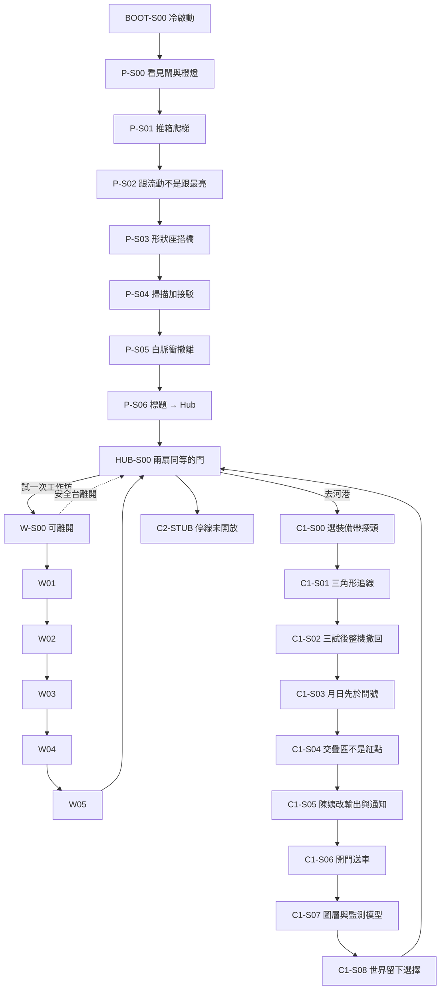

# P0 Level Design — 生命迴路：澄灣

| Field | Value |
|---|---|
| Document | `docs/design/p0-level.md` |
| Companion | `docs/design/p0-beats.json` |
| Role | Lead Level Designer — game-first greybox bible |
| Version | `2026-08-15-p0` |
| Locale | Player HUD / task / VO: `zh-Hant`. This file is production, **not** player UI. |
| Script authority | `Life_Circuit_Chengwan_Full_Game_Script_v1` (2026-08-15 Game-first Rewrite) |
| Scope | `BOOT-S00`, `HUB-S00`, `P-S00`–`P-S06`, optional `W-S00`–`W-S05`, `C1-S00`–`C1-S08`, honest `C2-STUB` |
| Out of scope | Playable Ch. 2–Final. Card / quiz Critical Path. Copied rooms, UI, VO, or layouts from cited games. |

This file tells blockout, lighting, camera, and quest how **space** produces the script. Claims live in `docs/claims/p0-claims.md`. Learning order lives in `docs/education/p0-learning.md`. Safety locks live in `docs/safety/p0-boundaries.md`. Delivery flags live in `docs/delivery/p0-contract.md`.

If a room can be passed by reading, clicking every highlight, or answering a quiz, **the room is not built**.

---

## 0. What “game-first” means on this floor

A new player who never saw a document must, without a lore card:

1. **30 seconds:** say the visible goal in their own words — 救人 / 到上面的閘 / 把門接上 / 把探頭帶回來 / 找出訊號往哪邊。
2. **90 seconds:** do a spatial verb — walk a line, pulse a wall, rotate a plate, aim a body, carry a sealed mass.
3. **On fail:** see a world consequence they can name, then recover without a red X or a death screen.
4. **On success:** the space itself changes (gate rises, water turns, dock opens, harbor furniture appears). The HUD does not say 「正確」.

Biology terms, Codex, and Human Practices copy **follow** those verbs. They never replace them.

---

## 1. Authority and conflict

1. Named team Science / Safety / Education sign-off *(none present 2026-08-15)*.
2. New full script `Life_Circuit_Chengwan_Full_Game_Script_v1`.
3. This file + `p0-beats.json` for **space, routing, fail/recover, anti-quiz**.
4. Legacy claim register: **safety wording only**.
5. Legacy GDD / TDD: only if they do not restore card quizzes, PRE classrooms, or MerR / Pmer / dTomato as a lock.

Workshop skip is **never** a qualification gate. Harbor and workshop doors on the Hub table are equal. Skipping writes no warning and does not lock `C1`.

---

## 2. Structure citations — method only, Chengwan rooms only

Borrow **grammar**. Invent every mesh, sightline, prop, sound, and UI. Do **not** reproduce mountain camps, loot warehouses, solar-system loops, exclusion-zone cars, or white test chambers.

| Cited structure | Grammar we take | Chengwan transformation | Explicitly do not copy |
|---|---|---|---|
| **PEAK** | Destination is visible before any text. Movement and a readable mistake *are* the opening story. | Spawn frames 三號防洪閘 + 小岑’s orange SOS. Falls are a 1.2s safety line, not a corpse cam. | Climbing race, stamina mountain, camp kit, peak silhouette, their HUD. |
| **R.E.P.O.** | Carried objects have mass, inertia, and break states. Evac pressure comes from the thing in your hands. | Tether plates, sealed probe, beacons, rover relay. Shock / drop / wind are physical. | Shop loop, monster extraction, price tags, their grab-beam look. |
| **Outer Wilds** | Follow a signal with your body. Knowledge opens geometry. Environment can invalidate a route. | Flow Lens pulse + triangle density. 陳姨’s rain sluice is an unmapped cut. Tide closes the first pier. | Time loop, planetary scale, traveler instruments, rumbling wood-flute, their ship. |
| **Pacific Drive** | Hub prepare → sortie → extract evidence → repair → go out again. Weather worsens on the return. | `HUB-S00` loadout → east shore → saturated probe → High-Bench van controls → second entry → rain finale. | Car, garage radio, Olympic Exclusion Zone, anomaly biomes. |
| **Portal 2** | One verb in a safe volume, then the same verb under pressure or in combination. | Prologue: move → interact → pulse → tether → combine → evac. Workshop: scale → copy → fold → gate → controls. | Portals, test-chamber chrome, announcer cadence, companion cube, emancipation grills. |

Also noted in the script, **not** as layout sources: Firewatch / Oxenfree walking-radio rhythm (short lines while moving). Do not copy their look or VO.

---

## 3. Ten floor laws (greybox must obey)

1. **See it, then walk it.** If the 30s goal needs a paragraph, the camera and landmark failed.
2. **Brightness is never the answer.** Live flow moves; dead shine fades or sits still. Taught in `P-S02`, paid off in `C1-S01` and `C1-S06`.
3. **Shape over paint.** Sockets, flags, triangle fill, moon/sun icons. Color may support; it may not be the only channel.
4. **Mass is a teacher.** Second plate heavier. Probe shocks offline unless crash shell. Beacon drop is Tether-recoverable.
5. **Completed work survives fail.** Relays, levers, latch steps, seated docks, carried records do not reset on evac fail.
6. **No death screen. No red X. No 「Wrong」.** Mist wipe, rope, safety valve, remote lock, quiet “no data layer.”
7. **No click-all Critical Path.** Fake highlights exist so exhaustive clicking is *worse* than reading flow.
8. **Two valid routes where the script says so.** Battery / shell; wide / tight zone; fixed station / portable kits. Different geometry, not saint/villain.
9. **Authority stays in other people’s hands.** Player opens doors and carries sealed kit. 郭工 / rover / lab own identity. No sample vial, no cleanup verb.
10. **Name after the phenomenon.** During the prologue crisis: zero biology terms. Workshop and C1 name only after the matching verb.

---

## 4. Verb curriculum (teach, then combine)

Portal-2 *structure*: one verb, then a room that needs two. Original rooms.

| Order | Verb | Safe teach | Pressure combine | Must not appear as |
|---|---|---|---|---|
| 1 | Walk / look / step-up | `P-S00` yellow spine, 20 cm pipe | Whole game | Minimap breadcrumb that plays the level for you |
| 2 | Interact / shove / climb | `P-S01` crate + ladder | Later hatches | Button that skips the crate |
| 3 | Flow Lens pulse | `P-S02` Three-Run Wall, first pulse free | `P-S04`, `C1-S01`, `C1-S06` | Permanent wallhack; “correct pipe” label |
| 4 | Tether pull / rotate / shape-snap | `P-S03` Cut Span plates | Probe cage, grate, rover, beacons | 2D card drag |
| 5 | Combine scan + seat | `P-S04` three relays | `C1-S03` external ports | “Fix all three” checklist UI |
| 6 | Evac + hold | `P-S05` white pulse, lift hold | `C1-S02` tide, `C1-S06` cable | Game Over timer splash |
| 7 | Carry sealed mass | `C1-S00` pick probe + loadout | `C1-S01` cage, `C1-S02` whole-unit retreat | Open-shell sample |
| 8 | Diagnose by moving the body | `C1-S02` turn / leave / kill relay | Unlocks repair verb | Quiz “why is it red?” |
| 9 | Restore references | `W-S04` optional; **hard** in `C1-S03` | Second harbor entry | Unknown readable on a broken sun |
| 10 | Place a claim in space | `C1-S04` beacons; `C1-S07` model | Harbor + Hub furniture | A/B ethics cards |

---

## 5. World atlas — original Chengwan volumes

All names below are **this game’s**. Do not relabel them after cited maps.

### 5.1 澄灣研究站外殼 — Prologue storm shell

One loaded volume. Rain, metal tick, cut radio. Destination always readable in the default third-person frame.

| Space ID | Role | Greybox notes |
|---|---|---|
| `ext.service_deck` | `P-S00` spawn | Wet grate platform, ~14 × 10 m. Camera yaw default: high gate left-of-center, SOS below it. Indoor door **left**; yellow spine **forward-right**. |
| `ext.amber_spine` | Mandatory walk | 0.4 m yellow service lamps, not a quest arrow. Length ~40 m with one 20 cm pipe (auto step-up). Glass slit at mid-spine shows water + SOS. |
| `ext.gate3_silhouette` | PEAK-structure landmark | 12–18 m above spawn, 80–120 m away. Stopped sluice blades. Always bigger than UI. |
| `ext.lower_call` | 小岑 | Not reachable in `P-S00`. Orange lamp, 3 s period, plus radio. Occluded by water; readable through glass. |
| `int.indoor_refuge` | Soft fail / curiosity | Door opens. Wrong for the goal. 方雅: 那邊是室內。控制室在橙燈上面。 Wall map lights ~8 m of spine. Not a lockout. |
| `int.dead_lift` | `P-S01` | Dark cage, no power. Fallen crate blocks the right ladder. Crate is light (one shove). Ladder 2.4–3.0 m, camera eases in, **never** steals stick. |
| `int.unlit_booth` | End of `P-S01` / start `P-S02` | Door cracked. One handheld on the desk: a single round button. No textbook card. |
| `int.three_run_wall` | `P-S02` | Three pipes. Top = brightest dead shine. Mid = live, dimmer, particles **toward the lock**, then **behind a panel**. Bottom = dull dummy. Occlusion is the puzzle. |
| `ext.cut_span` | `P-S03` | 1.0 m gap. No legal jump (jump = rope back). Two plates on the windward rack. Sockets are **chevron + notch**, not color-coded. Tether holster on the near post. |
| `int.actuator_gallery` | `P-S04` | Booth overlooks Gate 3. Power bus is lit. Command does not arrive. Three relays at floor / mid catwalk / hung yoke. |
| `int.return_cut` | `P-S05` | After the gate moves, the Cut Span loses its first plate (still locked, not a fail). New white-pulse corridor opens to the side. Lever missing from a door. Lift at the rescue lip. |
| `int.wet_bench` | `P-S06` | Indoor sit-down. Glass shows Gate 3 working. Title card. Soft fade to Hub. |

**Circulation:** spine is one-way curiosity-friendly (indoor allowed). After `P-S04`, the original bridge is **not** the evac path. That is the first “world changed under your feet” beat.

### 5.2 研究站大廳 — Hub

| Space ID | Role | Greybox notes |
|---|---|---|
| `hub.floor` | `HUB-S00` | One walkable floor, ~22 × 16 m. Rain visible through storm glass. Not a menu diorama. |
| `hub.briefing_table` | Choice as furniture | Two **physical** entries of equal size and light: 去河港, 試一次微觀工作坊. No third “you should study” door. |
| `hub.tool_wall` | After prologue | Flow Lens + Tether visible on hooks. After C1, sealed probe dock + first-fail plaque. |
| `hub.skyline` | Consequence window | Empty fog until `C1-S08`. Then either a market kiosk **or** numbered kit racks on piers. |
| `hub.c2_hatch` | Honest stub | Maintenance hatch labeled 停線（未開放）. Interact: 何主任 radio from `C1-S08` if C1 done; **no** factory load. |

### 5.3 微觀工作坊 — optional model wing

A real wing off the Hub, not a slide deck. Circular volumes ~16–20 m. Player may leave any **safe pad** (glow ring on the floor). Resume that scene ID.

| Space ID | Scene | Spatial idea |
|---|---|---|
| `ws.scale_well` | `W-S00` | Pull a ceiling scale handle. Walls unfold. Player stands *inside* a translucent cell. DNA = double rail **bolted to racks**. Exit = three aim frames. |
| `ws.reader_bench` | `W-S01` | DNA cannot leave the rack (Tether lock icon). Reader head travels the marked gene. RNA peels as a single carryable rail. |
| `ws.fold_ring` | `W-S02` | Annular walkway. Bead chain grows and folds. Protein fits a 3D lock and **turns** it. RNA does not seat. |
| `ws.smoke_hall` | `W-S03` | Linear run: sensor block → regulator yoke → promoter gate → reporter tower. Smoke machine on the left. Dark run first. |
| `ws.ref_lanes` | `W-S04` | Three sealed lanes: moon / sun / `?`. Icons before words. Sun joint is **broken on first run**. |
| `ws.shrink_desk` | `W-S05` | Room contracts to Hub scale. Desk replays the loop the player already ran. |

### 5.4 東岸河港 — Chapter 1

Semi-open, not a planet. ~80 × 120 m playable east shore plus the High-Bench van and the sluice roof. Re-routes when tide and rain change.

| Space ID | Scene | Spatial idea |
|---|---|---|
| `hub.floor` morning | `C1-S00` | Same Hub. Map wall shows three **time-stamped** blinks, no matching public stations. Loadout: battery **or** crash shell. |
| `hbr.east_promenade` | `C1-S01` | Safe first pulse. Market back-cut, pump-house crown, low finger pier, soak tunnel. |
| `hbr.false_warehouse` | `C1-S01` lure | Distant civic red blink, brighter than the signal, **no flow**. Following it yields a locked fence and city-light, not a record. |
| `hbr.live_pulse` | `C1-S01` truth | Weak pulse **against** surface current. Triangle reporter densifies when the body faces upstream-along-pipe. |
| `hbr.pump_slot` | `C1-S02` | Narrow rear corridor. After ~60 s, every facing saturates. |
| `hbr.high_bench_van` | `C1-S03` | Research van on the berm. Three sealed docks slide out. External service ports only. |
| `hbr.second_entry` | `C1-S04` | Market path flooded. Roofs, yard crane span, drain tower. Free beacon placement, not three painted wells. |
| `hbr.rain_sluice` | `C1-S04` / `S06` | Unmapped cut 陳姨 knows. Official map does not draw it. |
| `hbr.stall_walk` | `C1-S05` | Market mouth → stall shade → cart at knee height → workbench → second walk. |
| `hbr.sluice_catwalk` | `C1-S06` | Upper maintained side only. Rover goes through. Player does not. |
| `hbr.square_map` | `C1-S07` | Physical 3D table. Layers = run history. Two handheld models to place. |
| `hbr.echo` | `C1-S08` | Montage cameras on the **chosen** furniture. Wall plaque of the first fail. |

---

## 6. Critical path graph

Workshop may also be entered **after** C1. Completing it later unlocks Codex and may retrofit Hub chatter; it must **not** rewrite `evidence.runHistory`.

---

## 7. Title + Hub beat sheets

### BOOT-S00｜標題／冷啟動 — ≤30 s to control

| Slot | Design |
|---|---|
| **Visible goal** | 開始、繼續、或設定。首次：雨聲黑場，然後站在維修台。 |
| **Verb** | Click a real DOM control. First play does **not** dump a bible. |
| **Spatial puzzle** | None on the title. The “puzzle” is restraint: no lore wall, no 「本遊戲是教學故事」. |
| **Failure consequence** | WebGL fail → DOM 「無法啟動 3D」 + settings, never a black void. Continue with no save → same as New. |
| **Recovery** | Settings persist in `localStorage`. New always starts `P-S00`. |
| **No quiz bypass** | There is nothing to answer. Title is not a pre-test. |
| **Structure** | Pacific Drive *loop start* only: prepare later, storm now. Not their garage. |
| **HUD** | 開始 / 繼續 / 設定. Game title **生命迴路：澄灣** waits until `P-S06`. |

### HUB-S00｜研究站大廳 — 1–2 min

| Slot | Design |
|---|---|
| **Visible goal** | 走到中央桌。兩扇門：河港，或微觀工作坊。 |
| **Verb** | Walk a floor. Look through the skyline window. Interact with a **door volume**, not a chapter list. |
| **Spatial puzzle** | Equal lighting and scale on both entries. Curiosity props (tool wall, rain glass) must not outshine the table. After C1, the window **is** the last chapter’s claim. |
| **Failure consequence** | C2 hatch: one radio line, door stays shut. Workshop leave mid-scene: resume flag only. |
| **Recovery** | Always re-enterable. Skip workshop = no modal. |
| **No quiz bypass** | No “which chapter have you unlocked” exam. Harbor is legal with `workshop.complete === false`. |
| **Structure** | Pacific Drive Hub-as-garage **function**. Research-station floor, not a car. |

---

## 8. Prologue 黑水線 — 8–10 min

**Chapter promise:** like 小岑, learn move + two tools, finish a readable rescue. **Zero biology terms** until the sit-down.

**Fun Gate:** destination visible without reading; safety rope not Game Over; bright ≠ direction taught by animation.

### P-S00｜暴雨入站 — 1 min

| Slot | Design |
|---|---|
| **Visible goal** | 到防洪控制室。高處閘門 + 下方橙燈。 |
| **Verb** | Walk the yellow spine. Auto step-up the pipe. Look through glass. |
| **Spatial puzzle** | Dual attractors: warm indoor door vs high cold gate. Indoor is allowed and **wrong**. The spine is the only route that keeps the SOS growing in frame. |
| **Failure consequence** | Fall → safety line, 1.2 s, last amber **anchor** (place anchors every 8–12 m). Linger 12 s → 小岑 jab. Look the wrong way 3 s → 方雅. |
| **Recovery** | Rope. Indoor redirect + wall map. No HP, no fade-to-black fail. |
| **No quiz bypass** | No “which way is the control room?” prompt. If the player never walks, the scene never completes. |
| **HUD** | **到防洪控制室.** Only. |
| **30 / 90** | 30s: see gate + SOS. 90s: on the spine past the glass. |
| **Structure** | PEAK: see the high thing immediately. |

### P-S01｜電梯死機 — 1 min

| Slot | Design |
|---|---|
| **Visible goal** | 電梯沒電。從右邊梯子上去。 |
| **Verb** | Interact-push the crate. Climb. Enter the dark crack. |
| **Spatial puzzle** | Crate mass is low but occupies the ladder volume. Climb is a **low** vault, not a parkour course. Handheld reads as a tool because it is the only lit object. |
| **Failure consequence** | None hard. Crate can be pushed off-axis; still movable. |
| **Recovery** | Shove again. No timer. |
| **No quiz bypass** | Ladder collision stays blocked until the crate moves. A glowing “use ladder” prompt on a blocked volume is a design fail. |
| **Structure** | Portal 2: first interact in zero threat. |

### P-S02｜借來的透鏡 — 2 min

| Slot | Design |
|---|---|
| **Visible goal** | 叫醒牆上的維修標記，讓門鎖亮起。 |
| **Verb** | Hold-charge, release pulse. Walk the **moving** run. Press the loose relay home. |
| **Spatial puzzle** | Three-Run Wall. Brightest run is a dead reflector (fades ~1 s after pulse). Live run is dimmer, directional, then **occluded** by a service panel — player must sidestep. Battery ring appears after the free first pulse; no definition text. |
| **Failure consequence** | Follow the flare → line dies, lock stays dark. Empty battery → pulse refuses, ring blinks; wait to recover. |
| **Recovery** | Live run still moves if they pulse again. First pulse free so the lesson is readable. |
| **No quiz bypass** | Highlighting all three pipes does nothing. Only seating the **live** relay opens the lock. There is no “pick the correct line” list. |
| **Structure** | Outer Wilds: signal, not waypoint. Portal 2: one new verb, safe. |
| **Transfer** | Same rule returns at the warehouse blink and the sluice residue. |

### P-S03｜斷掉的橋 — 2 min

| Slot | Design |
|---|---|
| **Visible goal** | 把兩塊板拉來，扣進缺口，走過去。 |
| **Verb** | Tether grab, pull, push, rotate, snap. |
| **Spatial puzzle** | Gap 1.0 m. Plate A: light, **one** pose seats in the chevron socket. Plate B: heavier, slower angular accel, wind gusts. After crossing, plate A lifts in the wind but the lock holds — comedy + physics, not a fail. |
| **Failure consequence** | Drop → safety cable returns plate to the rack. Fall → rope to the near lip. Wrong pose: no snap (shape mismatch is readable). |
| **Recovery** | Cable / rope. Assist mode: within ~15° + 20 cm, auto-align. |
| **No quiz bypass** | Plates do not “click to place.” Distance, rotation, and socket shape are required. Color-only sockets are a fail against the script. |
| **Structure** | R.E.P.O.: mass and drop. Portal 2: teach tether before the combine room. |

### P-S04｜閘門下方 — 2 min

| Slot | Design |
|---|---|
| **Visible goal** | 電在，命令沒到。找斷點，讓閘門聽見一次。 |
| **Verb** | Pulse to see where command **stops**. Tether debris. Re-seat or re-route a relay. |
| **Spatial puzzle** | Three faults, three heights. **Wrong path:** seated but looping to a dummy bus — must unplug and route to the actuator run. **Jammed:** crate in the yoke; pulse shows the stop; clear then seat. **Loose:** hanging, press home. Order free. Each fix adds a layer of machine sound. Last snap: wall lights, gate **rises**, water **turns**, 小岑’s deck slips. |
| **Failure consequence** | Wrong-bus seat: lights the dummy loop, actuator silent. Dropped crate can pin a footpath. No “正確”. |
| **Recovery** | Unplug and try the other run. Debris re-grabbable. |
| **No quiz bypass** | A three-item checklist that completes on look-at is illegal. The gate only moves when all three **electrical / mechanical** states are true. |
| **Structure** | Portal 2 combine. PEAK: the high thing finally moves. |

### P-S05｜回頭跑 — 1–2 min

| Slot | Design |
|---|---|
| **Visible goal** | 沿白色脈衝跑到救援台，按住升降，把小岑拉上來。 |
| **Verb** | Sprint the new cut. Pulse if lost. Tether the missing lever. Hold the lift. |
| **Spatial puzzle** | Old span is unusable (first plate lifted). White emergency pulse leads a side corridor that **did not exist** before the gate moved. Lever is on the floor past a short crawl. Lift is a **hold**, not a tap — 小岑 rises while water climbs the marks. |
| **Failure consequence** | Standard: 70 s to the hold start. Water-first → mist wipe, 方雅 lock, restart at **corridor mouth**. Relaxed timer: no hard fail; water stays theatrical. |
| **Recovery** | Lever stays seated. Completed tethers stay. 小岑: 閘替我擋了一次。再來。 |
| **No quiz bypass** | Cannot skip to a “rescue” button from the booth. Path is physically gated by the lever door. |
| **Structure** | Pacific Drive extract. PEAK: the destination you saw is now behind you and in danger. |

### P-S06｜天亮之前 — 1 min

| Slot | Design |
|---|---|
| **Visible goal** | 坐下來。看閘在動。標題。然後走進大廳選下一扇門。 |
| **Verb** | Watch, then walk into Hub control. Choose 河港 or 工作坊. |
| **Spatial puzzle** | None. This is a **breather** so the title lands after competence, not before. |
| **Failure consequence** | None. |
| **Recovery** | — |
| **No quiz bypass** | No recap quiz. 小岑 names the **method** (看它怎樣流), not a glossary. Skip workshop: no warning. |
| **Persist** | `prologueComplete`, both tools, `xiaocen.rescued`, `workshop.available`, `hub.unlocked`. |

---

## 9. Optional Workshop 微觀工作坊 — 12–15 min

**Not an exam.** Walkable model. Leave / resume by scene. Completing it only forks 林博士’s C1 language (`C1-S00-D003` vs `D003A`) and may label C1 docks with small type. It must not lock a single C1 interactable.

DNA → RNA → protein arrows are **information**. Grabbing DNA shows a lock. That is the science, as a physical rule.

### W-S00｜放大一萬倍 — 2 min

| Slot | Design |
|---|---|
| **Visible goal** | 走進放大的細胞，看清楚：外殼、長軌、軌上的短段。 |
| **Verb** | Pull scale handle. Lens boundary / rail / marked stretch. Tether the **magnifier frame**, never the DNA. Aim three exit frames in order. |
| **Spatial puzzle** | Containment as scale: cell volume ⊃ rail length ⊃ short marked gene. Exit door plays that inclusion as animation only when aim-order is correct. |
| **Failure consequence** | Wrong aim order: frames dim, door stays. Grab DNA: lock icon, rail does not move. |
| **Recovery** | Re-aim. No red X. Safe pad to Hub. |
| **No quiz bypass** | Three labeled buttons “cell / DNA / gene” are illegal. The door reads **camera aim + order**, not a multiple choice. |
| **Name after** | 林博士: 細胞模型；長軌是 DNA；gene 是一段. |

### W-S01｜保留下來的軌道 — 2 min

| Slot | Design |
|---|---|
| **Visible goal** | 讓讀取頭做出一份可以帶走的新軌，舊軌留在架上。 |
| **Verb** | Start the reader. Tether the RNA copy to the next station. |
| **Spatial puzzle** | Two rails of different mass and rights: DNA welded, RNA free. Wrong station: RNA tip **keeps streaming** toward the fold ring. |
| **Failure consequence** | Wrong dock: no snap, glow keeps pointing. DNA grab: lock. |
| **Recovery** | Follow the glow. Not a fail state. |
| **No quiz bypass** | Cannot “select transcription.” The next room is physically empty until an RNA rail arrives. |
| **Name after** | transcription, once the copy exists. |

### W-S02｜會折起來的產物 — 2 min

| Slot | Design |
|---|---|
| **Visible goal** | 看珠鏈折好，把它放進會轉的鎖。 |
| **Verb** | Ride / walk the ring. Seat the folded protein. |
| **Spatial puzzle** | Shape lock. Protein turns the barrel. RNA offered to the same lock will not seat (wrong silhouette). |
| **Failure consequence** | RNA in lock: visible mismatch, barrel still. |
| **Recovery** | Take it back. Protein remains. |
| **No quiz bypass** | No “which molecule does the work?” cards. The lock is a 3D keyway. |
| **Name after** | translation / protein, after the barrel turns. |

### W-S03｜閘門與報告燈 — 3 min

| Slot | Design |
|---|---|
| **Visible goal** | 先看沒有煙霧時燈為什麼暗；再開煙，跟著訊號走到旗。 |
| **Verb** | Run dark. Tether-open smoke. Pulse the chain. Swap the lamp for a **shape flag**. |
| **Spatial puzzle** | Four world objects in a line. Delay on the reporter is visible (half-second spool). Swap proves output **form** ≠ sensing logic. |
| **Failure consequence** | Skip the dark run: smoke hall still forces a no-input cycle (gate shut, lamp/flag dark) before the machine accepts smoke. |
| **Recovery** | Close smoke, run dark again. Always legal. |
| **No quiz bypass** | Naming promoter from a list does not open the door. Door opens after: dark run + smoke run + flag swap (player has operated output change). |
| **Name after** | input, regulator, promoter, reporter, output. |
| **Transfer** | Chen walk **requires** the flag insight as a verb, with or without these words. |

### W-S04｜先測設備 — 3 min

| Slot | Design |
|---|---|
| **Visible goal** | 月亮該暗、太陽該亮。太陽也暗時，不要讀問號。 |
| **Verb** | Run. Pulse the sun joint. Tether-repair the break. Run again. Only then read `?`. |
| **Spatial puzzle** | First run is **authored broken**. All three dark. Flow Lens shows the sun coupler open. `?` hatch collision stays solid. Second run: moon dark, sun bright, `?` mid / fluctuating. |
| **Failure consequence** | Trying `?` early: hatch does not move. That **is** the lesson. |
| **Recovery** | Fix joint, re-run. Exit still sealed until the pair is valid. |
| **No quiz bypass** | Cannot skip to a definition of control. Cannot click `?` as “maybe empty.” Failed positive control **blocks** unknown. Same hard rule as `C1-S03`. |
| **Name after** | negative / positive control, valid run — after the second run. |

### W-S05｜你剛才做的循環 — 1–2 min

| Slot | Design |
|---|---|
| **Visible goal** | 看見自己剛做過的圈：問、組、跑、斷、修、再測。 |
| **Verb** | Watch the desk replay. Walk back to Hub. |
| **Spatial puzzle** | None new. The shrink is a camera/set piece so the Hub table feels like the same world. |
| **Failure consequence** | Leave early: `workshop.complete` stays false. Legal. |
| **Recovery** | Re-enter from Hub; resume this scene. |
| **No quiz bypass** | No DBTL four-letter exam. 小岑: 名字不是通關密碼. |
| **Persist** | `workshop.complete`, Codex flags from prior rooms. |

---

## 10. Chapter 1 紅色警報 — 35–50 min

**30s promise:** 找出警報反覆指向的方向，好讓確認隊走一條安全的路。

**Enjoy hunt + rain before controls are named.** End-state the player can say: reporter is output; control proves a run is readable; a screening signal is not identity and not cleanup.

**Structure:** Outer Wilds signal + knowledge; Pacific Drive sortie / repair / return; R.E.P.O. fragile carry.

### C1-S00｜河港還在睡 — 3 min

| Slot | Design |
|---|---|
| **Visible goal** | 帶封閉探頭去東岸，追第一次訊號。桌上選電池或抗撞外殼，只能帶一件。 |
| **Verb** | Pick sealed probe. Pick **one** loadout. Walk to the east-shore airlock. |
| **Spatial puzzle** | Loadout is a **physical claim about risk**, not a moral test. Map wall: three blinks at different times, adjacent public stations dark. No vials, no A/B/C/D pins. |
| **Failure consequence** | Trying to take both objects: second snaps back. Trying to leave without the probe: airlock stays shut (the probe *is* the outing). |
| **Recovery** | Either loadout completes the chapter. Dialogue fork only on workshop. |
| **No quiz bypass** | No “which module is the sensor?” test. 方雅 states the permission split: you carry device + route; 郭工 confirms. |
| **HUD** | 沿東岸步道追蹤第一次訊號. |

### C1-S01｜第一條紅線 — 6 min

| Slot | Design |
|---|---|
| **Visible goal** | 轉身體，看三角形何時跳得更密；把完整記錄帶到泵房側面。 |
| **Verb** | Pulse environment. Aim the sealed probe. Tether float crates. Cage the probe across a cable the player cannot climb while holding it. |
| **Spatial puzzle** | Four textures, one truth. Market back-cut (occlusion, voices). Pump crown (height, cleaner pulse). Finger pier (gap + float crates). Soak tunnel (must cage the probe). **Lure:** warehouse civic red, brighter, still. **Truth:** weak pulse against current. Fish / oil / smell are observations written into a scratch pad, **not** evidence stamps. |
| **Failure consequence** | Probe shock: crash shell stays up; battery loadout needs a wall outlet, 10 s restart. Follow warehouse: locked fence, no record slot. Drop probe in water: bob + Tether recover; if untreated shock, same as above. |
| **Recovery** | Both loadouts can finish. Record writes only at the pump-side jack when the triangle has been **direction-stable**. |
| **No quiz bypass** | No three “candidate sites” with one green check. The warehouse is *designed* to steal click-all players. Carrying a record is the claim. |
| **Reporter** | Triangle fill + optional tick sound. Never red/green only. |
| **Persist** | `c1.firstTraceRecovered`. |

### C1-S02｜全部都紅 — 5 min

| Slot | Design |
|---|---|
| **Visible goal** | 先弄清楚工具是不是還在說話；然後把**整支**探頭帶回高地流動站。 |
| **Verb** | After saturation: **must** turn in place, leave the slot, kill the env relay. Then carry. Evac the roof. |
| **Spatial puzzle** | Authored saturation ~60 s in. Every facing = max triangle. Mission **does not flip** until the three spatial tests fire. Self-test icon then blinks inside the shell. Tide kills the pier. Battery: short lift. Shell: shorter carry over a beam. Times similar. |
| **Failure consequence** | Overstay → 郭工 remote lock, fade to van mouth, **probe kept**, no blame. Treating saturation as “the whole river is max” is a player hypothesis the next room will break. |
| **Recovery** | Appear at High-Bench with the invalid run already in `evidence.runHistory`. Cannot delete. |
| **No quiz bypass** | A dialogue choice “the tool is broken” must **not** skip the three tests. Flip is code-gated on `triedTurn && triedLeave && triedKillRelay`. |
| **Persist** | `c1.invalidRunExperienced`, failed run retained. |
| **Structure** | Outer Wilds: instrument can lie. Pacific Drive: extract now. |

### C1-S03｜先證明它看得見 — 6 min

| Slot | Design |
|---|---|
| **Visible goal** | 月亮低、太陽高之後，才准看問號。 |
| **Verb** | Dock moon. Dock sun (still max = not restored). Lens into transparent self-test. External-port reset of regulator relay + swap sealed wet reporter joint. Re-run pair. Then `?`. |
| **Spatial puzzle** | Van side-rack: three docks, icons first (labels only if workshop complete). Shell never opens. Pulse shows stuck relay + wet joint. `?` collision off until moon low **and** sun high. `?` then mid + fluctuation (uncertainty, not a replicate course). |
| **Failure consequence** | `?` solid while sun is wrong. UI shows two control states + session clock. **Never** `100% 準確`. |
| **Recovery** | Ports remain. First fail stays on the van’s paper roll / later the station wall. 方雅 forbids delete. |
| **No quiz bypass** | Cannot “select positive control.” Cannot publish a harbor claim from this van. Unknown unreadable until the pair is valid — same as `W-S04`, even if workshop was skipped. |
| **Persist** | `c1.controlsRestored`, `evidence.controlRunBeforeClaim`. |
| **Transfer** | Second entry airlock stays shut until this flag. **F6:** knowledge is a new verb. |

### C1-S04｜第二次進入 — 7 min

| Slot | Design |
|---|---|
| **Visible goal** | 交出一塊確認隊能走進的範圍，不是一個紅點。 |
| **Verb** | Place up to two relay beacons. Walk the third reading. Accept an overlap. Optional: take 陳姨’s unmapped sluice. |
| **Spatial puzzle** | Tide sealed the market road. Roofs + crane span + drain tower. **No painted triad.** Overlap is computed from headings + quality (occlusion lowers quality). Near/occluded beacon vs far/exposed beacon. Wide/fast vs far/tight **both** write `c1.sourceZoneMarked`. Crane: beacon can fall, Tether retrieve. 陳姨 radio opens a dark cut the official decal missed — stakeholder knowledge as **geometry**. |
| **Failure consequence** | Tiny or huge overlap: accept is allowed only below a generous max area (wide still valid) and above a minimum quality so “place both in your pocket” fails. Dropped beacon: retrieve, not lose the chapter. |
| **Recovery** | Re-place. First-trace overlay stays on the map so they do not repeat `S01`. |
| **No quiz bypass** | Three “sample wells” with one correct well are **illegal**. The claim is a **polygon you made**. Confirm time on the later map differs; there is no score. |
| **Persist** | `c1.sourceZoneMarked`. Rover path in `S06` must match this polygon. |

### C1-S05｜陳姨的路 — 5 min

| Slot | Design |
|---|---|
| **Visible goal** | 讓站在棚下、推車後面的人看得見、聽得到，並知道下一步和誰更新。 |
| **Verb** | Place a demo probe at the market mouth. Walk **behind** 陳姨. Change the workbench. Walk again. |
| **Spatial puzzle** | Playable usability test, **not** a cutscene. Beat 1: daylight OK, stall shade kills color-only (one dull maroon blob). Beat 2: cart occludes a low panel; seated / child eye-height cannot see it. Beat 3: text that only says 紅 → NPCs argue leave vs stop using water. Workbench sliders are **world props**: shape flag, short chime, action line, municipal board + timestamp. Second walk must succeed. |
| **Failure consequence** | Missing visible channel / next action / owner+time → specific confusion, 陳姨 will not call it usable. Scene cannot complete. |
| **Recovery** | Change on the spot. Re-walk is instant. No affinity meter. |
| **No quiz bypass** | Honesty cards, “I will communicate better” dialogue, or a compliment cutscene with the same prototype are **Learning Gate fails**. Pass requires persist `shape_audio` **and** `municipal_update_with_timestamp`. |
| **HP** | Residents are stakeholders. 阿哲 pressures the headline; he is not a villain. |

### C1-S06｜閘門背後 — 6 min

| Slot | Design |
|---|---|
| **Visible goal** | 打開遠端門，把確認隊無人車送進去。自己不要進去。然後撤。 |
| **Verb** | Catwalk with the probe. Pulse two pipes. Tether the grate, not the live pressure line. Seat rover relay. Plug the “remember finished steps” module across brownouts. Hold evac cable. |
| **Spatial puzzle** | Maintained side vs unknown side: a hard volume lock. Left pipe: bright, **still** residue (P-S02 lesson). Right pipe: weaker, flowing. Grate blocks the rover. Touching the pressure line: safety valve slams, grate blows back — readable causality. Rain brownouts clear the door memory until the latch module is seated (function first, **no** formal name). Door opens, rover enters, water climbs the yellow mark. |
| **Failure consequence** | Wrong pipe / pressure line: world pushes back, no gore. Water catch-up: rescue cable to the last platform. |
| **Recovery** | Latch progress kept. Rover does not need re-doing if already through. |
| **No quiz bypass** | Player cannot “confirm the chemical” by walking in. There is no identity interactable on the far side. 郭工: 正式結果稍後由實驗室發布. |
| **Structure** | R.E.P.O. carry + Pacific Drive extract. Outer Wilds: flowing vs bright-still. |

### C1-S07｜說到證據為止 — 4 min

| Slot | Design |
|---|---|
| **Visible goal** | 把實際跑過的圖層打開給廣場看，並放下一種監測模型。 |
| **Verb** | Toggle five obtained layers. Attempt forbidden layers. Carry one physical model onto the city plate. |
| **Spatial puzzle** | The table **is** `evidence.runHistory`: invalid first run, controls restored, overlap zone, rover route, waiting lab result. Each layer triggers one character line. 「全河安全」「已完成清理」→ **目前沒有資料圖層** (quiet, no scold). Two models on pedestals: heavy kiosk vs crate-of-kits. Placing one **builds** far-view props. 陳姨 and 郭工 do not choose. |
| **Failure consequence** | Cannot finish without placing a model. Cannot finish with a forbidden layer “on.” |
| **Recovery** | Toggle off. Pick the other model; last placed wins. |
| **No quiz bypass** | No “which statement is responsible?” exam. Claim ≤ evidence is a **missing mesh**, not a lecture. Both models are full clears. |
| **Persist** | `c1.publicMapPublished`, `c1.monitoringModel`, `world.harbor.monitoringModel`, `unresolved += confirmation_result, long_term_monitoring`. |

### C1-S08｜城市回聲 — 2 min

| Slot | Design |
|---|---|
| **Visible goal** | 看見三件自己造成的事；第一次失效留在牆上。 |
| **Verb** | Walk the montage path. Read the plaque. Hear 何主任. Optionally touch the C2 hatch later in Hub. |
| **Spatial puzzle** | Branch set dressing: attended kiosk near market **or** numbered kits / return racks / training marks on several piers. **Both** keep 陳姨’s stop button and a public board. Station wall: 「令設計改變的事件」= the saturated run. Recap is three facts, not a grade. |
| **Failure consequence** | None. Unresolved stays listed. This is a complete ending that does **not** solve the river. |
| **Recovery** | — |
| **No quiz bypass** | No “you understood control” stamp. Radio hook to 停線 is story, not a factory level. |
| **Persist** | `c1.complete`. Hub skyline. `C2-STUB` visible. |

### C2-STUB｜停線（未開放）

Honest signage. One radio line if C1 is done. **No** load, **no** quality-release button, **no** wet process poster that teaches a protocol.

---

## 11. Dual-valid routes (must play as geometry)

| Node | Route A | Route B | Same clear? | Different later |
|---|---|---|---|---|
| `C1-S00` loadout | Battery: more pulses; shock → wall power 10 s; evac uses short lift | Crash shell: shock ignored; evac is a shorter carry | Yes | Feel of `S01`/`S02` only |
| `C1-S04` zone | Wide / fast / safer roofs | Far beacon / tighter / riskier span | Yes | Confirm-team **time** on the map, not a score |
| `C1-S07` model | `fixed_station`: attended kiosk, far patrol, single-point failure visible | `portable_kits`: many piers, charge / version / training visible | Yes | Hub skyline + harbor furniture |
| Workshop | Play | Skip | C1 legal either way | Language + Codex only |

Do not light one route greener.

---

## 12. Fail / checkpoint / recover (global)

| Event | Player sees | Keep | Never |
|---|---|---|---|
| Fall from deck / span / roof | 1.2 s rope to last anchor | Tools, progress | Death cam, ragdoll chapter reset |
| Plate / beacon / probe drop | Object exists; Tether or cable | — | Inventory delete as punishment |
| `P-S05` water first | Mist wipe, corridor mouth | Lever, tethers | 70 s in relaxed mode |
| `C1-S02` overstay | Remote lock, van mouth | Probe, invalid run | Blame VO |
| `C1-S03` / `W-S04` early `?` | Hatch does not move | — | Red X, definition popup as scold |
| `C1-S06` pressure line | Valve slam, grate back | Latch if already in | Gore, chemical ID |
| `C1-S06` water catch-up | Cable to last pad | Latch, rover-through | Full finale reset |
| Fake public layer | 目前沒有資料圖層 | — | 「錯誤！」 |
| WebGL fail | DOM message | Settings | Black screen |

Soft checkpoint = scene start + every **world-state bit** listed in `p0-beats.json` `persist`.

---

## 13. Anti-quiz construction notes

Old card verbs → this floor (script appendix C). Implementers: if you are about to add a widget, stop.

| Tempting widget | Why it fails Fun Gate | Build this instead |
|---|---|---|
| A/B/C/D “where is the source?” | Click-all | Body-facing triangle + false warehouse |
| Evidence / Claim / Impact cards | Claim ≠ action | Placement, docking, publishing layers |
| “What is a promoter?” | Password | Smoke hall gate that you open |
| Three painted sample wells | Exhaustive click | Free beacon geometry |
| Honesty / persuasion lines | NPC as vending machine | Chen second walk on a revised prop |
| 「正確」toast | Red-X family | Gate rises, water turns, hatch moves |
| Chapter recap MCQ | Classroom smash-cut | Three player-caused facts + furniture |
| Workshop as locked ticket | Qualification exam | Equal Hub doors, silent skip |

**QA sniff test:** hand a build to someone who says “I just want to mash.” They should get lost on the dead-bright line, bounce off a solid `?` hatch, and get a quiet no-data layer — not a gold star.

---

## 14. Camera, lighting, audio as level tools

| Channel | Use | Do not |
|---|---|---|
| Camera | Default frame: destination + SOS (`P-S00`). Ease-in on ladder, never steal. Shoulder stay on evac. Reduced motion: keep pulse **direction** readable. | Recoil punches that hide flow. |
| Light | Amber spine = route. Orange SOS = person. White evac pulse = temporary. Civic red warehouse = lure. | Quest-golden interactables on every prop. |
| Audio | Pulse tick densifies with heading. Each `P-S04` fix adds a mechanical layer. Chen chime is a **required** reporter channel. VO ≤ ~12 s. | Color-only alarms. Music that drowns the pulse. |
| HUD (DOM) | Verb + object. Battery as a ring, no definition. Large subtitles. | Developer disclaimers. Knowledge score. Mini-map that solves `S01`. |

All meters are `TEACHING_SIMULATION`: low / mid / high / fluctuating, triangle fill. No real units. If a still could be cropped as lab data, watermark **that readout only** with 教學模擬.

---

## 15. Accessibility is routing, not an options footnote

| Setting | Level implication |
|---|---|
| Relaxed timer | `P-S05` loses hard 70 s. Same path, same story, same save flags. |
| Reduced motion | Shorter camera punches; **do not** hide particle direction or triangle fill. |
| Hold alternatives | Lift hold and Lens charge have a toggle / tap-to-latch option. |
| Keyboard + mouse | Full Critical Path. Tether rotate on mouse + keys. |
| Color + shape + sound | Critical Path reporters. Color-only **fails** `C1-S05`. |
| Workshop skip | Access. Not a gifted certificate, not a penalty. |
| Safe pads | Workshop leave volumes are large, lit, and announced in-world, not a pause-menu “quit lesson.” |

---

## 16. Greybox priority (script Vertical Slice 0)

Build **playable collision + verbs** before set dressing. Art must not delay Fun Gate.

**Slice 0 (20–25 min), in this order:**

1. Third-person move, camera, step-up, interact (`P-S00`–`P-S01`).
2. Flow Lens: direction, occlusion, battery, false shine (`P-S02`).
3. Tether: weight, rotate, collision, shape snap, drop recover (`P-S03`).
4. Combine + evac (`P-S04`–`P-S05`).
5. Hub table two doors + loadout (`HUB-S00`, `C1-S00`).
6. Triangle hunt + crate / cage (`C1-S01`).
7. Saturation three-tests + extract (`C1-S02`).
8. Moon / sun / `?` hard gate (`C1-S03`).

Then: beacons, Chen walk, finale, public map. Workshop can parallel once Lens + Tether exist.

**Blockout kit (suggested, original):** 1 m grid, amber 0.4 m strips, 1.0 m gap prefab, chevron/notch socket pair, sealed probe capsule (carry volume ~0.4 × 0.25 × 0.25 m), moon/sun/`?` dock trio, rover that fits a 0.8 m door.

Performance targets live in `docs/delivery/p0-manifest.json` `budgets`. Greybox should stay under those until art ADR.

---

## 17. Per-scene lighting / landmark cheat sheet

| Scene | Read in 30s | False friend |
|---|---|---|
| `P-S00` | Gate silhouette + orange period-3 lamp | Indoor warmth |
| `P-S02` | Moving particles toward lock | Brightest flare |
| `P-S03` | Socket **silhouette** | Paint color |
| `P-S04` | Pulse stop = the break | Already-lit power bus |
| `P-S05` | White pulse in the new cut | Old span |
| `C1-S01` | Triangle density vs current | Warehouse civic red |
| `C1-S02` | Same max every heading | “The river is all red” |
| `C1-S03` | Sun still max | Touching `?` first |
| `C1-S04` | Overlap polygon | A single pin |
| `C1-S05` | Shade + cart + missing next step | Bench prototype that looked fine indoors |
| `C1-S06` | Flowing right vs still-bright left | Walking into the unknown |
| `C1-S07` | Layers you actually ran | 全河安全 / 已完成清理 |

---

## 18. Dialogue vs space

VO is a **spotlight**, not a lecturer. If a line does not change where the player looks or what they can grab, it does not belong on the Critical Path (script player-copy rules).

Keep script IDs. Do not invent extra teach-y lines. Especially do not add:

- 「完成練習不代表……」
- 「本章涉及……」
- 「這不是……指引」
- 「太棒了！你理解了 control」

Characters speak want, danger, next step. Codex, if opened, is one closable line **after** the matching flag.

---

## 19. QA — spatial (not knowledge)

Run these without a designer over the shoulder. Full behavioural flags stay in the education / safety docs.

| Test | Pass |
|---|---|
| Mute VO, hide subtitles, start `P-S00` | 4/5 still walk toward the gate / orange lamp |
| Follow every brightest thing in `P-S02` and `C1-S01` | Door / record does **not** complete |
| Mash every dock in `C1-S03` | `?` stays shut until sun is valid |
| Talk through `C1-S05` without touching the workbench | Scene cannot end |
| Request 全河安全 | Quiet no-data; chapter can still complete via a monitoring model |
| Die / fail every evac once | No death screen; completed seats remain |
| Skip workshop, play C1 | Harbor door works; living phrases play |
| Place either monitoring model | Harbor + Hub differ; both have stop + board |

Open playtest questions (no options) are in `docs/education/p0-learning.md` §10. Record **outside** the game. No in-game score.

---

## 20. Remaining gaps (honest)

| Gap | Path |
|---|---|
| No named Science / Safety / Education sign-off | Public efficacy claims stay blocked. Greybox may proceed. |
| Runtime not in repo | This file is a floor plan. Collision and verbs still have to be built. |
| Exact graybox metrics are targets | Tune after first stick time; do not pad with reading to hit 8–10 / 35–50. |
| English locale | Not a P0 Critical Path. |
| Ch. 2–Final spaces | Stub only. Do not block out a factory “just in case.” |
| Cited-game legal review | Structure notes only; art must not drift toward those silhouettes. |

---

## 21. What this delivery contains

| File | Purpose |
|---|---|
| `docs/design/p0-level.md` | This file: atlas, verb curriculum, beat sheets, fail/recover, anti-quiz, greybox order. |
| `docs/design/p0-beats.json` | Machine-readable beats: `visibleGoal`, `verb`, `spatialPuzzle`, `failureConsequence`, `recovery`, `noQuizBypass`, plus persist / tools / QA. |

No meshes, scenes, or player-facing UI were added in this pass.
